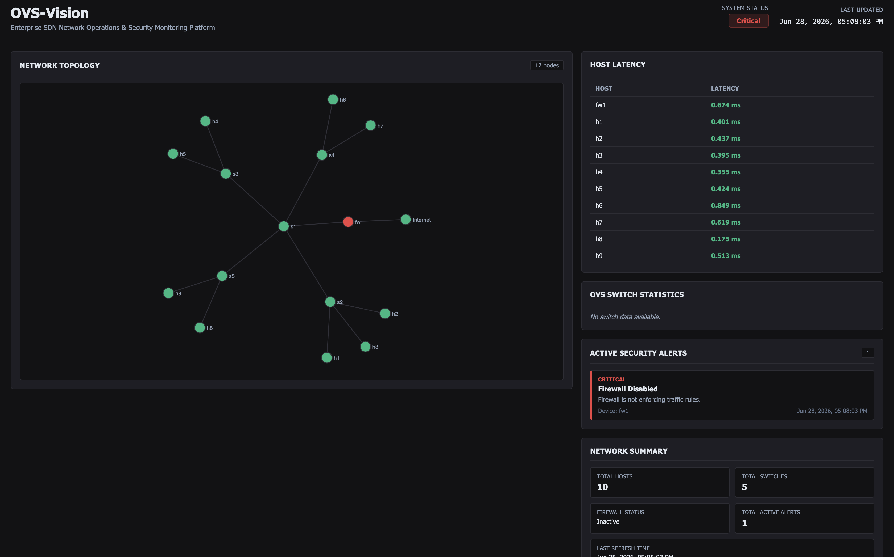
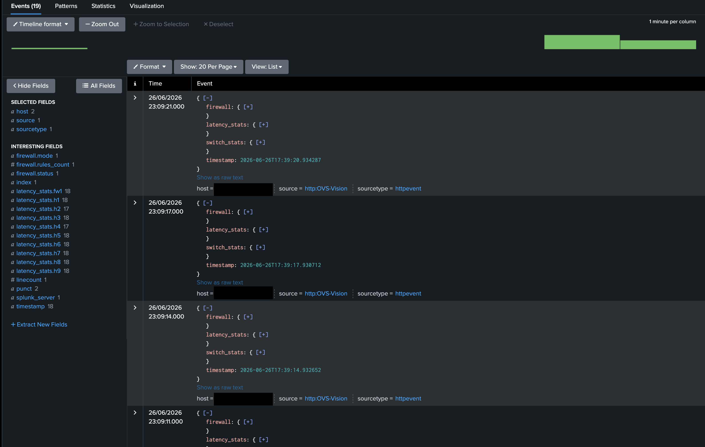

# OVS-Vision

**Enterprise SDN Network Operations & Security Monitoring Platform**

OVS-Vision is a real-time SDN monitoring platform that collects telemetry from an Open vSwitch (OVS) network, visualizes network health using D3.js, detects security events, and forwards alerts to Splunk Enterprise.

---

## Features

* Enterprise network simulation using Mininet
* Open vSwitch telemetry collection
* Interactive D3.js network topology
* Host latency monitoring
* OpenFlow port statistics
* Firewall health monitoring
* Packet loss detection
* Security alert generation
* Splunk Enterprise (HEC) integration

---

## Technology Stack

* Python
* Flask
* Mininet
* Open vSwitch (OVS)
* D3.js
* Splunk Enterprise
* HTML, CSS, JavaScript

---

## Architecture

```text
            Mininet + OVS
                  │
                  ▼
           Telemetry Engine
             (monitor.py)
                  │
        ┌─────────┴─────────┐
        ▼                   ▼
 Flask Dashboard      Splunk Enterprise
```

---

## Screenshots

### Dashboard



### Splunk Dashboard


