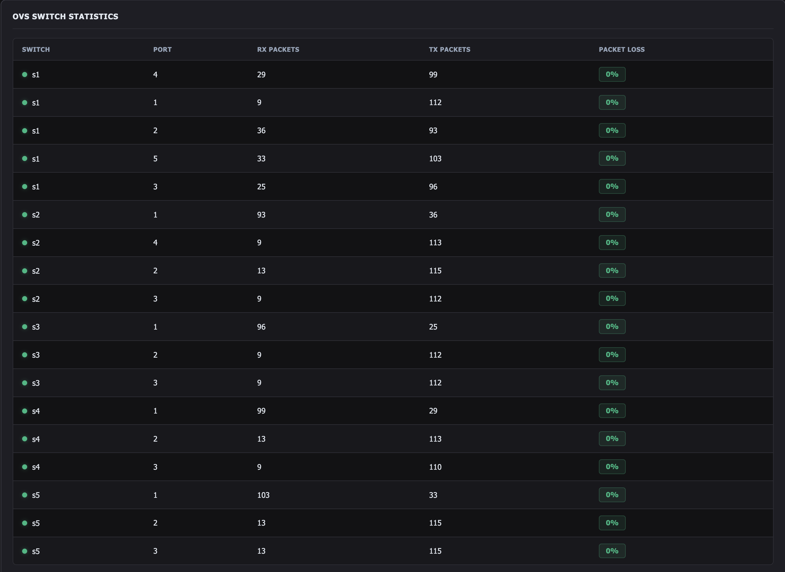
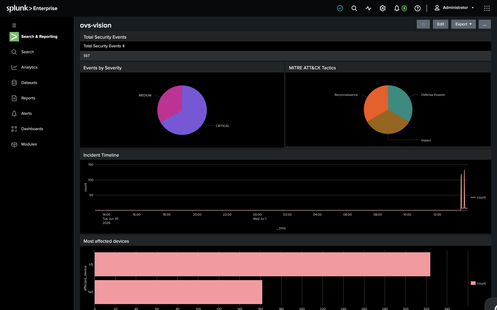

# OVS-Vision

Enterprise SDN Network Operations & Security Monitoring Platform.

OVS-Vision is a real-time monitoring dashboard for Software Defined Networks (SDN). It collects telemetry from Open vSwitch (OVS), monitors network performance, detects security events, maps alerts to the MITRE ATT&CK framework, generates SOAR playbooks, and forwards events to Splunk Enterprise.

---

## Features

- Real-time SDN monitoring using Mininet and Open vSwitch
- Interactive D3.js network topology
- Host latency monitoring
- OpenFlow switch statistics
- Firewall status monitoring
- Security alert generation
- MITRE ATT&CK mapping
- Automated SOAR playbook generation
- Splunk Enterprise (HEC) integration
- Live Flask dashboard

---

## Technology Stack

- Python
- Flask
- Mininet
- Open vSwitch (OVS)
- D3.js
- Splunk Enterprise
- HTML
- CSS
- JavaScript

---

## Dashboard


### Dashboard


---

### OVS Switch Statistics



---

### Splunk Dashboard 



---

## Architecture

```text
Mininet
      │
      ▼
Open vSwitch
      │
      ▼
Telemetry Engine (monitor.py)
      │
      ├──────────────► Security Detection
      │                     │
      │                     ▼
      │              MITRE ATT&CK Mapping
      │                     │
      │                     ▼
      │              SOAR Playbook Engine
      │
      ├──────────────► Splunk Enterprise
      │
      ▼
Flask Dashboard
```

---

## Future Improvements

- Network attack simulation from Kali Linux
- Port scan detection
- DoS detection
- Historical metrics and trend analysis
- User authentication

---

## Author

**Chethana R**

B.E. Computer Science & Engineering (Cyber Security)
